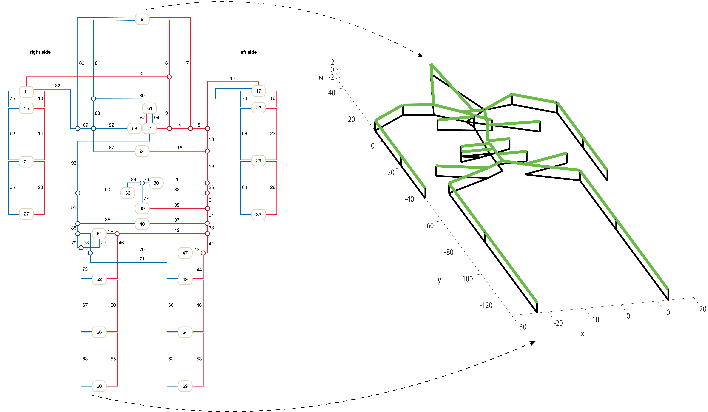
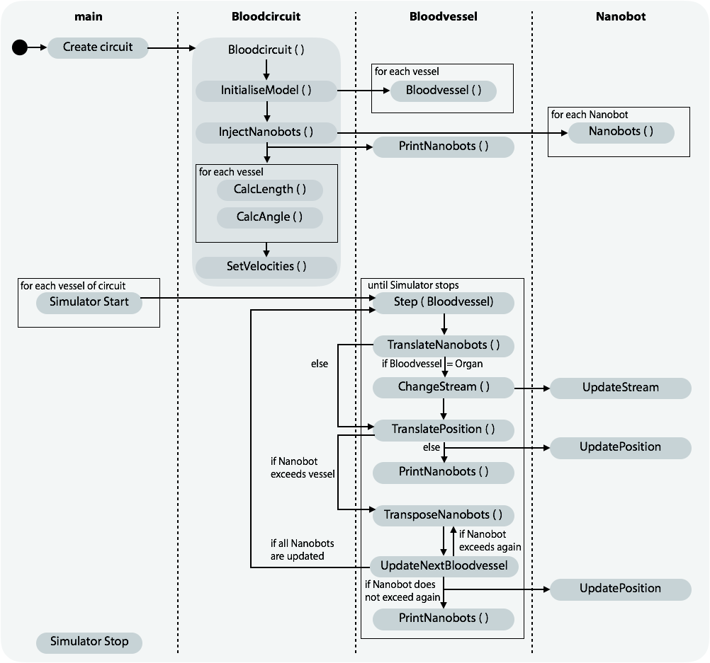
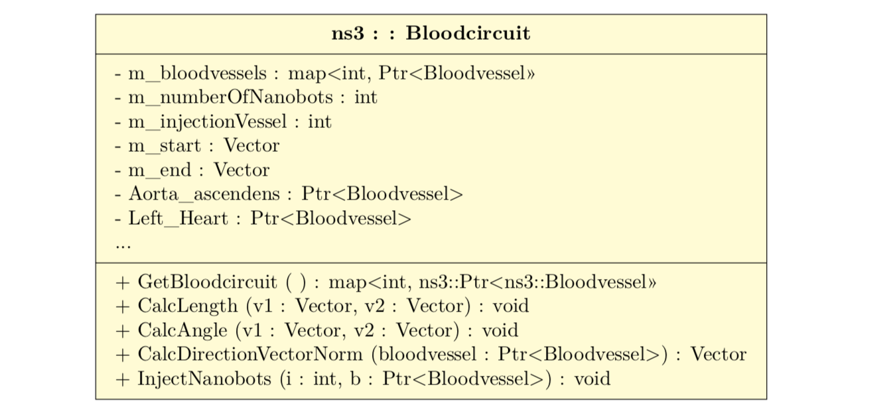
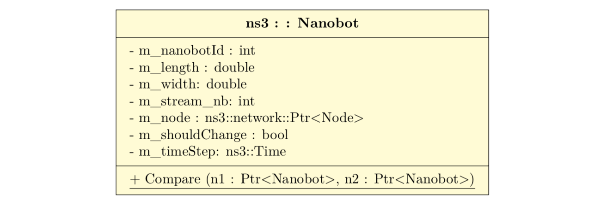
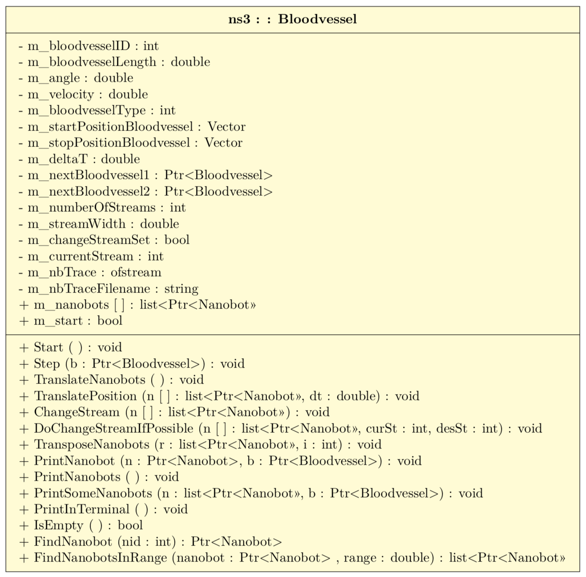

= BloodVoyagerS - BVS: An ns-3 Extension to Simulate the Human Cardiovascular System
Regine Wendt <wendt@itm.uni-luebeck.de>
v1.1, 2019-04-24

== Introduction

BVS is a ns-3 module that simulates the global movement of objects in the human body. It’s main purpose is to model the work environment of medical nanobots. The simulation of nanobots in their working environment is crucial to promote their application in the medical context. Several simulators for nanonetworks investigate new communication paradigms at nanoscale. However, the influence of the environment, namely the human body, on the movement and communication of nanobots was rarely considered so far. Currently there are three open-source nanonetwork ns-3 extension, namely https://telematics.poliba.it/index.php?option=com_content&view=article&id=30&Itemid=204&lang=en[NanoSim], https://github.com/ieee-p1906-1-reference-code/p1906-dev[p1906] and https://ubnano.tech/nano_downloads/terasim/[TeraSim] that are readily usable. We propose the combination of one of those, or your own nanonetwork simulators with BVS. Our simulator is in a prototypical state at the moment and we’re consistently working on it’s development. At the moment it features a simplified model of a human body’s cardiovascular system to simulate the nanobots’ mobility. Feel free to use BVS and contact us for any remark or contribute to our code. Be sure to have also read our paper describing it.

If you are looking for a way to visualize your simulation results please visit our extended github for BVS-VIS. 

== Features

  - 3D coordinates of major vessels and organs
  - Simulates permanent movement of nanobots in cardiovascular system
  - Injection of nanobots in specific vessels
  - Provides global position data of nanobots (/ns-3.2x/csvNano.csv)

== Important Parameters

  - Number of nanobots `m_numberOfNanobots`
  - Injection vessel `m_injectionVessel [1-94]`
  - Simulation duration in seconds `m_simulationDuration`
  - Duration between each simulation step `m_deltaT`
  - Velocities: `m_arteryVelocity = 10 cm/s, m_veinVelocity = 3,7 cm/s, m_organVelocity = 1cm/s`
  - Number of streams `m_numberOfStreams [1-5]`

== Model
.Visualisation of vessels described in Table 1

== Class overview
.Process diagram of `test-blood-voyager-s`

.UML

== Tutorial/Get started

=== You’ve already installed ns-3.26 or newer

If you’re already using ns-3.26 or a newer version you can download the blood-voyager-s folder and put it in the src folder. In addition, you need to put the vasculature.csv in your ns-3.26 folder. For further instructions see "Run BVS".

=== You're new to ns-3

You need to download the complete ns-3.26 (or newer) and follow the instructions in this  https://www.nsnam.org/docs/tutorial/html/getting-started.html[ns-3 tutorial]. Then you download the blood-voyager-s folder from here and put it in the src folder. In addition, you need to put the vasculature.csv in your ns-3.26 folder. For further instructions see "Run BVS".

== Run BVS
You can either write your own main method, or use test-blood-voyager-s. To run our test got to ns-3 folder:  

    SIMDURATION=   # simulation duration in seconds
    NUMOFNANOBOTS= # number of nanobots
    INJECTVESSEL=  # injection vessel [1-94]
    ./waf --run "test-blood-voyager-s --simulationDuration=$SIMDURATION --numOfNanobots=$NUMOFNANOBOTS --injectionVessel=$INJECTVESSEL"

The simulation returns a csv-file (/ns-3.2x/csvNano.csv) with the position data of the simulated nanobots in every timestep. 

== Appendix: Model
image::Images/table1.pdf[Table,890, width=60%]